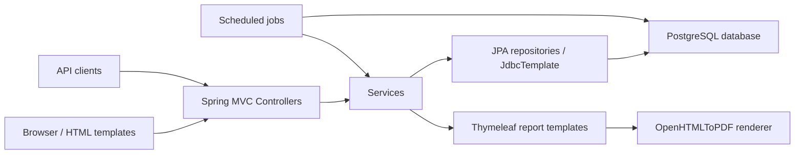

# System Overview

## Purpose

The application is a cooperative waste management system. It supports multiple cooperatives, worker measurements, stock tracking, normal sales, collective sales, reports, notices, analytics, material multipliers, and gamification.

## Technology Stack

- Java 25
- Spring Boot 3.5.11
- Spring Web MVC
- Spring Data JPA
- Spring Security
- PostgreSQL JDBC driver
- Bean Validation
- Thymeleaf
- OpenHTMLToPDF
- Springdoc OpenAPI
- OWASP Java HTML Sanitizer
- Maven wrapper
- Docker and Docker Compose
- GitHub Actions on a self-hosted `proxmox` runner

## Runtime Shape

`NetworkManagementSystemApplication` starts a standard Spring Boot application. Controllers expose JSON REST APIs and page routes. Services hold most business rules. Repositories use either Spring Data JPA or native SQL queries. Several gamification and multiplier flows use `JdbcTemplate` directly.

## Package Map

- `auth`: login, JWT creation and parsing, Spring Security filter, role helpers.
- `Cooperative_Analytics`: cooperative lookup, dashboard analytics, last sales, revenue, productivity, stock summaries.
- `buyers`: buyer listing.
- `materials`: material measurements, stock writes, bag state tracking.
- `Sales`: normal sale lifecycle and combined sale history.
- `Collective_Sale`: collective sale invitations, participation, stock reservation, cancellation, and own-sale views.
- `Sale_Reports`: normal and collective sale reports plus PDF generation.
- `noticeboard`: global and cooperative notices with sanitized content.
- `multiplier`: cooperative material multipliers.
- `gamification.achievements`: achievement definitions, XP overrides, worker summaries, achievement evaluation.
- `gamification.levels`: level definitions and worker level calculation.
- `gamification.leaderboard`: leaderboard snapshots and lookup.
- `frontend`: page route controller for Thymeleaf templates.
- `config`: OpenAPI JWT bearer security configuration.

## Main Data Flows

### Authentication

1. Client posts `cpf` and `password` to `/api/auth/login`.
2. `WorkerDetailsService` loads worker credentials and `user_type` from `public.workers`.
3. Spring Security authenticates the request with BCrypt.
4. `JwtUtil` creates a JWT containing `role`, `cooperativeId`, and `workerId`.
5. Later requests are authenticated by `JwtAuthFilter` from a bearer header, `token` query parameter, or `jwt` cookie.

### Material Measurement

1. Admin posts a weighing to `/api/insertMaterial`.
2. `MaterialService` compares the reported amount with the current bag state.
3. A measurement row is inserted using only the delta over the previous bag amount.
4. Bag state is updated or reset.
5. Cooperative stock is incremented by the computed delta.

### Normal Sales

1. Manager or admin creates a sale for the authenticated cooperative.
2. Active sales can be edited until completed or cancelled.
3. Completing a sale sets `sold_at` and subtracts sold stock.
4. Cancelling a sale sets `cancelled_at`.
5. Reports and PDFs read the persisted sale and related material, buyer, worker, and cooperative data.

### Collective Sales

1. A manager or admin creates a collective sale.
2. The creator cooperative is added as an accepted contribution.
3. The creator can invite other cooperatives.
4. Invited cooperatives can join, update contribution weight, or leave.
5. Contribution updates reserve or release stock atomically through `StockRepository.adjustStock`.
6. Cancelling a collective sale returns all reserved stock and sets `cancelled_at`.

### Gamification

1. Measurements and achievements feed monthly worker progress.
2. A daily scheduler evaluates current-month achievements and recalculates levels.
3. Weekly and monthly leaderboard jobs persist top-three snapshots.
4. Material multipliers and random cooperative multipliers affect leaderboard XP.

## External Surfaces

- REST API under `/api/**`
- Swagger UI under `/swagger-ui/**`
- OpenAPI JSON under `/v3/api-docs/**`
- Thymeleaf pages at `/login`, `/frontend`, `/normal-sale`, and `/collective-sale`
- Static tester pages under `/test.html` and `/collective-sale.html`
- PDF download endpoints under `/api/reports/pdf/**`

## Related Notes

- [[Runtime and Security]]
- [[Data Access and Persistence]]
- [[Scheduled Jobs]]
- [[Frontend Views]]
- [[API/API Reference|API Reference]]
- [[Planning/Code Inventory|Code Inventory]]

