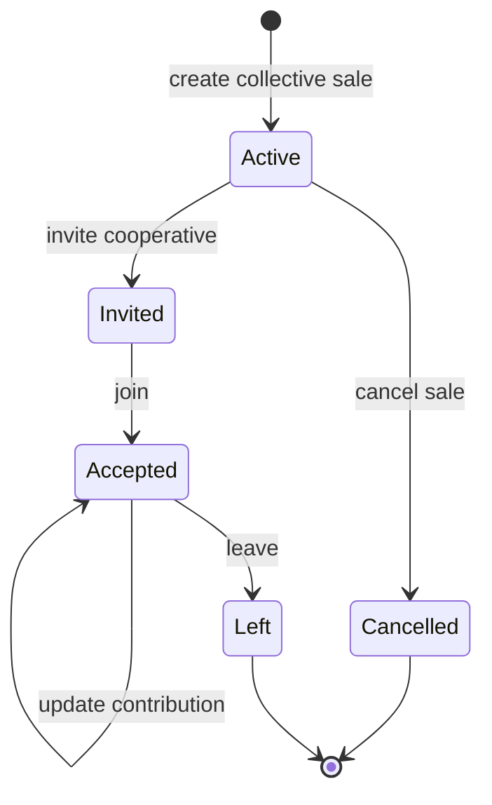

# Collective Sales

## Purpose

Collective sales let several cooperatives participate in one sale. One cooperative creates the sale, invites others, and participants reserve material stock through contribution weights.

## Main Files

- `CollectiveSaleController`
- `CollectiveSaleService`
- `CollectiveSaleRepository`
- `CollectiveSaleEntity`
- `ActiveCollectiveSaleDTO`
- `CollectiveSaleInvitationDTO`
- `CreateCollectiveSaleDTO`
- `InviteCooperativeDTO`
- `UpdateContributionDTO`
- `UpdateSaleMaterialDTO`
- `UpdateSalePriceDTO`
- `StockRepository`

## Database Tables

- `collective_sale`
- `collective_sale_contribution`
- `stock`

## Lifecycle

The code exposes cancellation but no observed endpoint that completes a collective sale by setting `sold_at`.

## Create Collective Sale

Endpoint:

- `POST /api/collective-sale`

Behavior:

1. Requires manager or admin.
2. Resolves authenticated cooperative.
3. Validates `expectedSaleDate` is in the future.
4. Saves `CollectiveSaleEntity`.
5. Adds the creator cooperative as an `ACCEPTED` contribution.
6. Returns the new collective sale ID.

Create fields:

- `materialId`
- `buyerId`
- `pricePerKg`
- `expectedSaleDate`

## Invite Cooperative

Endpoint:

- `POST /api/collective-sale/{saleId}/invite`

Behavior:

- Sale must exist and be active.
- Only creator cooperative or admin can invite.
- Caller cannot invite its own cooperative.
- Duplicate contribution status is rejected.
- Inserts contribution with status `INVITED`.

## Join

Endpoint:

- `POST /api/collective-sale/{saleId}/join`

Behavior:

- Sale must be active.
- Cooperative must already have an invitation.
- `ACCEPTED` invitations cannot be accepted again.
- `LEFT` cooperatives cannot rejoin.
- Status is updated to `ACCEPTED`.

## Update Contribution

Endpoint:

- `PUT /api/collective-sale/{saleId}/contribution`

Behavior:

1. Finds active sale material and current contribution for the authenticated cooperative.
2. Computes `delta = newWeight - oldWeight`.
3. Calls `StockRepository.adjustStock`.
4. If stock is insufficient, returns conflict with available stock.
5. Updates `contributed_weight`.

Stock meaning:

- positive delta reserves more stock by subtracting current stock.
- negative delta returns stock.

## Update Material

Endpoint:

- `PUT /api/collective-sale/{saleId}/material`

Behavior:

- Only creator cooperative or admin can update.
- Sale must be active.
- Material cannot change while accepted contributions have a positive weight.

## Update Price

Endpoint:

- `PUT /api/collective-sale/{saleId}/price`

Behavior:

- Only creator cooperative or admin can update.
- Sale must be active.
- Updates `price_kg`.

## Leave

Endpoint:

- `DELETE /api/collective-sale/{saleId}/leave`

Behavior:

- Creator cooperative cannot leave.
- Cooperative must be a participant.
- Reserved stock is returned by passing a negative delta to `adjustStock`.
- Contribution status is updated to `LEFT`.

## Cancel

Endpoint:

- `DELETE /api/collective-sale/{saleId}`

Behavior:

- Only creator cooperative or admin can cancel.
- Finds all accepted positive contributions.
- Returns each reserved stock amount.
- Sets `cancelled_at = now()`.

## Reads

Endpoints:

- `GET /api/collective-sale`
- `GET /api/collective-sale/invitations`
- `GET /api/collective-sale/my?status=ACTIVE|HISTORY`

Admin behavior:

- `GET /api/collective-sale` returns all active sales.

Manager behavior:

- `GET /api/collective-sale` returns active sales relevant to the manager's cooperative where contribution status is not `LEFT`.
- invitations endpoint returns pending `INVITED` rows.
- `my` endpoint returns active or history rows for the manager's cooperative.

## Related Notes

- [[API/API Reference|API Reference]]
- [[Models/Database Schema|Database Schema]]
- [[Materials Stock and Measurements]]
- [[Reports and PDFs]]

