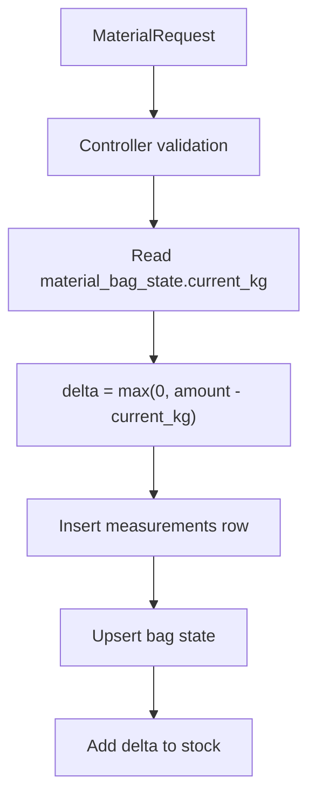

# Materials, Stock, and Measurements

## Purpose

This domain records worker material weighings, tracks in-progress bag state, and keeps cooperative stock totals synchronized with measurements and sale activity.

## Main Files

- `MaterialController`
- `MaterialService`
- `MaterialRequest`
- `Measurement`
- `MeasurementRepository`
- `MaterialBagState`
- `MaterialBagStateRepository`
- `Stock`
- `StockController`
- `StockRepository`
- `AddStockDTO`

## Measurement Flow

Endpoint:

- `POST /api/insertMaterial`

Access:

- admin only

Flow:



Request fields:

- `materialId`
- `workerId`
- `amount`
- `bagFull`
- `deviceId`

## Bag State Rule

`MaterialService.insertMaterial` reads the current accumulated bag amount and records only the delta:

```text
delta = max(0.0, request.amount - current_bag_kg)
```

If `bagFull` is true:

- `is_begun` becomes false.
- `current_kg` becomes 0.

If `bagFull` is false:

- `is_begun` becomes true.
- `current_kg` becomes the request amount.

## Stock Writes

`StockRepository` methods:

- `addToStock`: adds collected amount to existing stock row.
- `addToStockDecimal`: same with `BigDecimal`.
- `insertStockRow`: creates an initial stock row.
- `recordSale`: records normal-sale stock reduction.
- `adjustStock`: reserves or releases collective-sale stock.
- `findCurrentStock`: reads current stock for user-facing conflict messages.

## Manual Stock Add

Endpoint:

- `POST /api/stock`

Access:

- manager or admin

Behavior:

1. Resolves authenticated cooperative.
2. Adds amount to `total_collected_kg` and `current_stock_kg`.
3. If no row exists, inserts one with `total_sold_kg = 0`.

## Stock Reads

Endpoint:

- `GET /api/stock`

Implemented in `AnalyticsController`, not `StockController`.

Behavior:

- Managers read own cooperative stock.
- Admins must provide `cooperativeId`.
- Workers are forbidden.

## Sale Interactions

Normal sale completion:

- calls `recordSale`
- increases `total_sold_kg`
- decreases `current_stock_kg`

Collective contribution update:

- calls `adjustStock` with the contribution delta
- positive delta reserves stock
- negative delta returns stock

Collective leave and cancellation:

- call `adjustStock` with negative reserved weights to return stock

## Related Notes

- [[Normal Sales]]
- [[Collective Sales]]
- [[Models/Database Schema|Database Schema]]
- [[API/API Reference|API Reference]]

