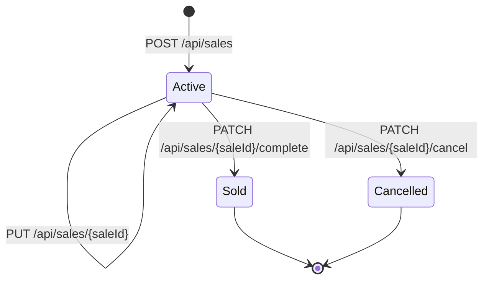

# Normal Sales

## Purpose

Normal sales represent one cooperative selling one material to one buyer. The code stores them in the `sales` table.

## Main Files

- `SalesController`
- `SalesService`
- `SalesRepository`
- `CreateSaleDTO`
- `UpdateSaleDTO`
- `SaleDTO`
- `StockRepository`

## Lifecycle

## Creation

Endpoint:

- `POST /api/sales`

Access:

- manager or admin

Behavior:

1. Controller rejects workers through `PermissionHelper.requireManagerOrAdmin`.
2. Cooperative ID is resolved through `determineTargetCooperative(null)`.
3. Responsible worker is the authenticated user's `workerId`.
4. `SalesRepository.insertSale` inserts the sale with `created_at = now()`.

Observed create fields:

- `materialId`
- `weight`
- `priceKg`
- `buyerId`
- `expectedSaleDate`

## Update

Endpoint:

- `PUT /api/sales/{saleId}`

Behavior:

- Updates nullable fields with SQL `COALESCE`.
- Only active sales can be updated.
- Sale must belong to the resolved cooperative.

## Complete

Endpoint:

- `PATCH /api/sales/{saleId}/complete`

Behavior:

1. Looks up material and weight for the sale/cooperative.
2. Sets `sold_at = now()` if the sale is active.
3. Calls `StockRepository.recordSale`.
4. `recordSale` increments `total_sold_kg` and subtracts `current_stock_kg` only if enough stock exists.

## Cancel

Endpoint:

- `PATCH /api/sales/{saleId}/cancel`

Behavior:

- Sets `cancelled_at = now()` if the sale is active and belongs to the cooperative.

## Reads

Endpoints:

- `GET /api/sales`
- `GET /api/sales/active`
- `GET /api/sales/history`

`GET /api/sales` returns normal sales only by `ACTIVE` or `HISTORY`.

`GET /api/sales/active` and `GET /api/sales/history` can include both normal and collective sales through `type=REGULAR`, `COLLECTIVE`, or `ALL`.

## SaleDTO Status

`SaleDTO` includes a derived `status` field. From constructor behavior observed through fields, status is based on timestamps such as `soldAt` and `cancelledAt`.

## Access Rules

- Workers cannot access normal sales endpoints.
- Managers can only access their own cooperative.
- Admins must provide `cooperativeId` for cooperative-scoped list endpoints.

## Related Notes

- [[API/API Reference|API Reference]]
- [[Models/Database Schema|Database Schema]]
- [[Reports and PDFs]]

